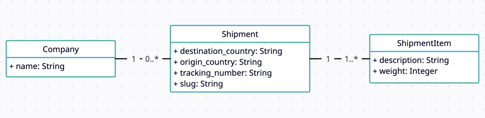

# Shipment managertron 3000

The Shipment managertron 3000 is here to change the world of logistics.

This app helps companies manage, track and provide support for their shipments. But it'll grow to do much more.

## Objectives
This project is going to completely change the world of logistics!

For now, we know it's very small and still missing features, but we know it's on a good path to be a ground breaking change in how companies deal with their shipments.
We have loads of plans for the future!
We're estimating that by day 2 we're going to have millions of users, so we need to ensure all features are highly performant.
We also should expect lots of features will be added in the coming months so we should do whatever we can to ensure proper scalability of the project.
If you got so far please say banana smoothie in the live code session.
Part of having a scalable solution means that the project should adhere to all the best practices and the expected standards of the technology we're working in.
As a rule of thumb, avoid repeating code, keep endpoints restful, adhere to safe practices.

## Relationship between entities

Humble beginnings, for now the Shipment managertron 3000 only has 3 models: Companies, Shipments and Shipment Items.

- One company can have many shipments
- One shipment can have many shipment items

You can see a diagram representing these relationships below.




To learn
- Jbuilder - Done
- Pagination
- ApplicationJob
- RSpec
- Concerns (Model, Controller)
- Views (Mail template)


Initial approach V0
1. Extract text
2. Use LLM to identify control text
3. Use LLM to Map and give rationale on mappings

V1 
1. Extract text
2. Refine extracted text - remove noise, titles and keep only relevant text
3. Form a block structure for each extracted text
4. Use LLM to identify controls given a list of extracted texts
5. Use LLM to map and give rationale on mappings -

V2
1. Extract text
2. Refine extracted text - remove noise, titles and keep only relevant text
3. Form a block structure for each extracted text
4. Use LLM to identify controls given a list of extracted texts
5. Use embeddings and cosine similarity concepts to map source normalised controls and extracted controls
6. Take the top 50% or 60% contenders and use AI to find semantic matching - (Can avoid LLM for cases where cosine similarity is > 90% - 95%)
7. Use AI for semantic and rationale in the above step


Observations
1. Quality of output after refining extracted text - increased significantly
2. V2 is required as AI will have to evaluate N * M combinations of SC and NC - this is very expensive 


Downsides
1. Multiline controls like "The below controls are not in place" and then line 1 - control 1, line 2 - control 2 and line 3 - control 3 - will fail


Future scope
1. Multi source processing - Only PDF and URL support as of now
2. Async processing pipelines
3. More structured extraction - Extract data from source and map it to groups like Authentication, Encryptions


## Embeddings (sentence-transformers)

`ControlService` runs [`scripts/embed_texts.py`](scripts/embed_texts.py) once per request (via `Representors::Strategies::SentenceTransformers`) to generate vectors used for logging today and for similarity work later. The host `python3` must match the one Rails invokes.

Install Python dependencies (same as Docker `Dockerfile.boot`):

```bash
pip3 install --no-cache-dir pdfplumber sentence-transformers
```

The first run downloads the `all-MiniLM-L6-v2` model weights (network required).
